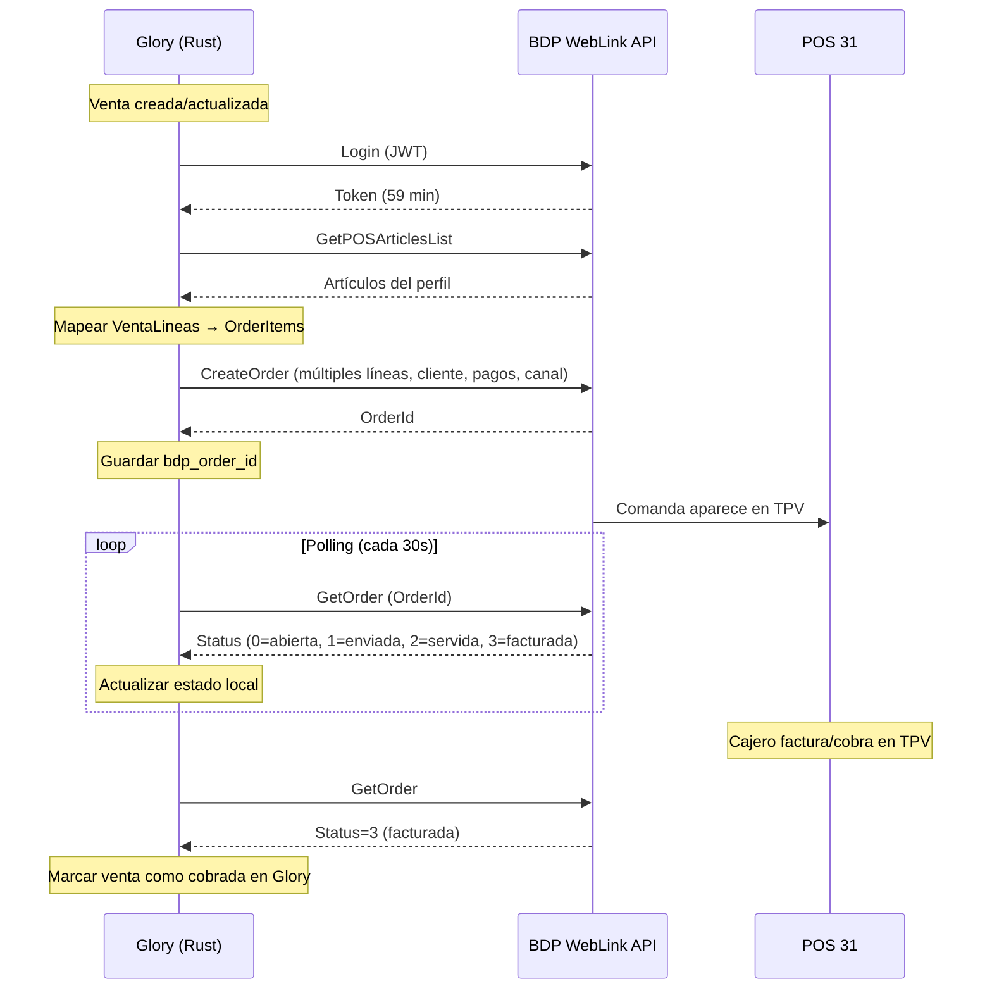

# BDP WebLink REST API — Estado de Integración

> **Fecha:** 2026-06-07 (actualizado 2026-07-15, post Fase 9 completa + UI frontend)
> **Autor:** Agente (análisis post-implementación 065A-5 + Category C tests 147A-5 + auditoría código 147A-6 + actualización secciones 3/4/5 por F2.7/F2.8/F3.1-3.3 + Fase 7.5+8 por 157A-4 + Fase 9 completa por 157A-7/157A-9/157A-10)
> **Stack:** Glory Rust Backend (Axum 0.7 + SQLx) ↔ BDP-NET WebLink REST API
> **Endpoint BDP:** `http://100.83.196.35:8068` (vía Tailscale)
> **POS:** 31 — CENTRAL 2026 (Series `00031TI`, IVA incluido)
> **Estado:** ✅ Integración verificada en producción + Fases 1-9 completas + UI frontend F9 = **111+ tests**
> **Plan activo:** Fase 10 — Extensiones futuras (ver sección 9 backlog)

---

## 1. Resumen ejecutivo

| Métrica                                                        | Valor                                       |
| -------------------------------------------------------------- | ------------------------------------------- |
| Endpoints documentados en API BDP                              | ~55                                         |
| Endpoints con constante en catálogo (`BDP_ENDPOINTS`)          | 21                                          |
| Endpoints con método en cliente (`BdpWeblinkClient`)           | 23 (incluye `check_order` variante + `post_authenticated`) |
| Endpoints invocados en sync productivo                         | **2** (`CreateOrder`, `GetPOSArticlesList`) |
| Endpoints invocados solo en preflight                          | 6 (health, get_version, export_departments_from_profile, get_employee, get_pos_employees, get_pos_tenders) |
| Endpoints invocados en polling                                 | **1** (`GetOrder` — polling periódico de estado de comandas) |
| Endpoints con orquestación completa (sync+handler)             | **2** (`AddOrderPayment`, `InvoiceOrder` — Fase 8) |
| Endpoints validados en Category C (read-only)                  | 3 (`ExportArticles`, `GetOrder`, `GetTenderList`) |
| Endpoints con cliente pero nunca llamados                      | 4 (cancel_order, export_departments, get_poses, get_employees) |
| Endpoints ⚠️ con problemas conocidos                           | 2 (`GetPOS` → `[404401]`, `GetPOSes` → vacío) |
| Endpoints no implementados en absoluto                         | ~30                                         |
| Direccionalidad actual                                         | **Bidireccional (Glory ↔ BDP)** — customer sync (F7.5), comandas (Glory→BDP), polling estado (BDP→Glory) |
| Campos Glory no enviados en `CreateOrder`                      | ~7                                          |
| Tests BDP (Cat A + B + C)                                      | **111+ tests, todos pasando** (46 originales + 19 bdp_sync + 9 venta_lineas + 1 poller + 17 bdp_article_map + 5 F9.1 + nuevos F9) |
| **Completitud de la integración**                              | **~40% del potencial** (multi-item, tender, customer, order type, polling, facturación, customer sync, catálogo completo, precios, mesas, menús operativos) |

---

## 2. Inventario completo de endpoints

### Leyenda

- ✅ Catalogado + Cliente + Invocado en producción
- 📋 Catalogado + Cliente implementado, **nunca llamado** (o solo en Category C tests)
- 🔧 Catalogado + Cliente, usado solo en preflight/diagnóstico
- ❌ No implementado en ninguna capa

### 2.1 Servicios

| Endpoint                | Método HTTP | Estado | Uso actual                                  |
| ----------------------- | ----------- | ------ | ------------------------------------------- |
| `ServiceHealth`         | GET         | 🔧     | Preflight: verifica conectividad            |
| `GetVersion`            | GET         | 🔧     | Preflight: versión BDP-NET                  |
| `GetApplicationVersion` | GET         | ❌     | —                                           |
| `Login`                 | POST        | ✅     | Interno: cada llamada autenticada lo invoca |

### 2.2 Artículos

| Endpoint                          | Método HTTP | Estado | Uso actual                                              |
| --------------------------------- | ----------- | ------ | ------------------------------------------------------- |
| `GetArticle`                      | POST        | ✅     | **F9.2 implementado**: fallback en resolve_article() cuando no está en mapa + lectura individual via `GET /api/bdp/articles/:id` |
| `GetPricesArticles`               | POST        | ✅     | **F9.3 implementado**: refresh precios artículos ya mapeados via `POST /api/bdp/article-maps/sync-prices` |
| `ExportArticles`                  | POST        | ✅     | **F9.1 implementado**: sync catálogo completo BDP → Glory vía `POST /api/bdp/article-maps/sync-catalog` |
| `GetPOSArticlesList`              | POST        | ✅     | Sync: resuelve artículo por código. Preflight: verifica |
| `GetFullArticlesList`             | POST        | ❌     | —                                                       |
| `CreateArticlesAndUpdateProfiles` | POST        | ❌     | —                                                       |
| `ModifyPricesArticles`            | POST        | ❌     | —                                                       |
| `ModifyArticleAndUpdateProfile`   | POST        | ❌     | —                                                       |

### 2.3 Clientes

| Endpoint          | Método HTTP | Estado | Uso actual                                                          |
| ----------------- | ----------- | ------ | ------------------------------------------------------------------- |
| `ExportCustomers` | POST        | ✅     | Fase 7.1: import masivo BDP→Glory + Fase 7.5: obtener next code    |
| `CreateCustomer`  | POST        | ✅     | Fase 7.2: push Glory→BDP + Fase 7.5: auto-sync al crear venta      |

### 2.4 Comandas (el núcleo de la integración)

| Endpoint          | Método HTTP | Estado | Uso actual                                                            |
| ----------------- | ----------- | ------ | --------------------------------------------------------------------- |
| `CreateOrder`     | POST        | ✅     | Sync: crea comanda (Type=0 Barra, OrderEndType=1). Preflight: dry-run |
| `GetOrder`        | POST        | ✅     | Polling periódico: detecta facturación (status=3) → marca bdp_invoiced |
| `CancelOrder`     | POST        | 📋     | ⚠️ Devuelve "Subscripción no activada" — endpoint NO disponible       |
| `AddOrderTip`     | POST        | ❌     | —                                                                     |
| `AddOrderPayment` | POST        | ✅     | Fase 8.1: orquestación en `BdpSyncService::add_order_payment()`, handler en `POST /api/ventas/:id/bdp-invoice` |
| `InvoiceOrder`    | POST        | ✅     | Fase 8.2: orquestación en `BdpSyncService::invoice_order()`, handler en `POST /api/ventas/:id/bdp-invoice` |

### 2.5 Comentarios

| Endpoint            | Método HTTP | Estado | Uso actual |
| ------------------- | ----------- | ------ | ---------- |
| `GetCommetsProfile` | POST        | ❌     | —          |

### 2.6 Departamentos

| Endpoint                            | Método HTTP | Estado | Uso actual                                   |
| ----------------------------------- | ----------- | ------ | -------------------------------------------- |
| `ExportDepartment`                  | POST        | 📋     | Cliente tiene método, nunca llamado          |
| `DepartmentsExportFromProfile`      | POST        | 🔧     | Preflight: verifica departamentos del perfil |
| `CreateDepartment`                  | POST        | ❌     | —                                            |
| `CreateDepartmentAndUpdateProfiles` | POST        | ❌     | —                                            |

### 2.7 Menús, Fast-Foods, Packs

| Endpoint                | Método HTTP | Estado | Uso actual |
| ----------------------- | ----------- | ------ | ---------- |
| `GetMenuDefinition`     | POST        | ✅     | **F9.5 implementado**: lectura informativa via `GET /api/bdp/menus/:id` (sin modelo Glory) |
| `GetFastfoodDefinition` | POST        | ✅     | **F9.5 implementado**: lectura informativa via `GET /api/bdp/fastfoods/:id` (sin modelo Glory) |
| `GetPackDefinition`     | POST        | ✅     | **F9.5 implementado**: lectura informativa via `GET /api/bdp/packs/:id` (sin modelo Glory) |

### 2.8 Fidelización

| Endpoint    | Método HTTP | Estado | Uso actual |
| ----------- | ----------- | ------ | ---------- |
| `GetPoints` | POST        | ❌     | —          |
| `AddPoints` | POST        | ❌     | —          |

### 2.9 Terminales

| Endpoint   | Método HTTP | Estado | Uso actual                                                |
| ---------- | ----------- | ------ | --------------------------------------------------------- |
| `GetPOS`   | POST        | ⚠️    | **Devuelve `[404401]` desde ~junio 2026** — cambio en API de BDP. No afecta CreateOrder |
| `GetPOSes` | POST        | ⚠️    | **Devuelve respuesta vacía** — limitación de API. No afecta integración               |
| `GetPOSSeriesList` | POST        | ✅     | **F9 implementado**: lectura informativa via `GET /api/bdp/series/:id` |

### 2.10 Empleados

| Endpoint          | Método HTTP | Estado | Uso actual                                 |
| ----------------- | ----------- | ------ | ------------------------------------------ |
| `GetEmployee`     | POST        | 🔧     | Preflight: verifica empleado configurado   |
| `GetEmployees`    | POST        | 📋     | Cliente tiene método, nunca llamado        |
| `GetPOSEmployees` | POST        | 🔧     | Preflight: verifica empleados del terminal |

### 2.11 Formas de Pago

| Endpoint           | Método HTTP | Estado | Uso actual                                      |
| ------------------ | ----------- | ------ | ----------------------------------------------- |
| `GetTenderList`    | POST        | 📋     | Category C test: lectura formas de pago contra BDP real     |
| `GetPOSTenderList` | POST        | 🔧     | Preflight: verifica formas de pago del terminal |

### 2.12 No implementados en absoluto (~20 endpoints)

- **Perfiles:** `GetProfilesListCreateDepartmentList`, `GetProfilesListCreateArticleList`, `GetProfileListModifyArticleList`
- **Exportación:** `ExportDocumentsByExportProfile`, `ExportStockAndSalesSummaryByExportProfile`, `ExportManagmentDocumentsByExportProfile`, `ExportPurchaseNotes`
- **Stock:** `CreateFamily`, `CreateSubfamily`, `GetStock`, `GetListStock`, `GetItemCostPrices`, `GetItemsCostPrices`, `Regularizations`, `Transfers`, `UpdateMassiveStock`, `UpdateStock`, `UpdateMassiveInventory`
- **Suplementos:** `GetSupplementsProfiles`, `GetPOSSupplementsProfile`
- **Talla/Color:** `GetInfoSAC`, `GetItemSAC`
- **Salones:** `GetRoomTables`, `GetRoomsTables` — ✅ **F9.4 implementado** (sync a plano de sala Glory via `POST /api/bdp/sync-tables`)
- **Series:** (ya catalogado arriba en 2.9 como 🔧)

---

## 3. Flujo actual (lo que funciona hoy)

### Sync de comandas (Glory → BDP)

```
Glory: Venta creada/actualizada
  → VentaService::spawn_bdp_sync()
    → BdpSyncService::sync_venta()
      → Login a BDP (admin/kamples2026, JWT ~59 min)
      → [NUEVO F7.5] Si bdp_auto_sync_customers=true && cliente_id:
        → ensure_cliente_bdp_synced()
          → Si cliente no tiene bdp_customer_code:
            → ExportCustomers para obtener siguiente código BDP
            → CreateCustomer con nombre, NIF, teléfono, email
            → Guarda bdp_customer_code en Cliente
      → GetPOSArticlesList para resolver artículo default
      → VentaLineaRepository::listar_por_venta() → líneas (si existen)
      → resolve_line_articles(): mapea cada línea vía bdp_article_map (F2.8)
      → resolve_order_context():
          → resolve_tender_id(): metodo_pago → bdp_tender_map → TenderId (F3.2)
          → resolve_order_type(): canal → bdp_order_type_map → Type (F3.3)
          → resolve_customer(): cliente_id → Cliente → Name/Phone/Code (F3.1)
      → CreateOrder multi-item con TenderId, Type y Customer (F2.7+F3.x)
      → Guarda bdp_synced=true, bdp_order_id en BD
```

### Facturación/Pagos (Glory → BDP)

```
Glory: POST /api/ventas/:id/bdp-invoice
  → BdpSyncService::invoice_venta()
    → Login a BDP
    → [Si amount + tender_id]: add_order_payment()
      → POST /API/Orders/Payment/Add (registra pago)
      → Si respuesta incluye InvoiceNumber → bdp_invoiced=true
    → invoice_order()
      → POST /API/Orders/Invoice
      → bdp_invoiced=true, bdp_order_status="invoiced"
```

### Polling de estado (BDP → Glory)

```
BdpOrderPollerService::poll_loop()
  → Cada bdp_poll_interval_secs (default 30s):
    → SELECT ventas con bdp_synced=true Y bdp_order_status NO IN ('invoiced','cancelled')
    → Para cada venta: GetOrder(BDP)
    → Si status=3 (facturada): UPDATE bdp_invoiced=true, bdp_order_status='invoiced'
    → Borrado lógico en Glory si BDP indica cancelación
```

### Lo que se envía en `CreateOrder`

```json
{
    "Order": {
        "Type": 0,
        "OrderEndType": 1,
        "EmployeeId": 1,
        "ItemsProfileId": 1,
        "AlreadyInvoiced": false,
        "Invoice": false,
        "MarketplaceOrderId": "G<timestamp_15chars>",
        "ExecutionTime": "2026-07-15T12:00:00Z",
        "Comments": "Glory venta <id>",
        "TenderId": 1,
        "Customer": { "Name": "Juan García", "Phone": "600123456" },
        "Items": [
            {
                "Lin": 1,
                "Id": 549,
                "Name": "CAFE BOMBON",
                "Units": 2.0,
                "Price": 2.5,
                "Supplement": 0.0,
                "Discount": 0.0,
                "DiscountPct": false,
                "Total": 5.0,
                "VatPct": 10.0,
                "OrderItemType": 0
            },
            {
                "Lin": 2,
                "Id": 831,
                "Name": "TOSTADA",
                "Units": 1.0,
                "Price": 3.5,
                "Supplement": 0.0,
                "Discount": 0.0,
                "DiscountPct": false,
                "Total": 3.5,
                "VatPct": 10.0,
                "OrderItemType": 0
            }
        ]
    }
}
```

### Resolución de datos (F2.7–F3.3)

| Dato                 | Fuente Glory                    | Resolver                                    |
| -------------------- | ------------------------------- | ------------------------------------------- |
| Artículos por línea  | `venta_lineas[].articulo_codigo`| `bdp_article_map` → código BDP (F2.8)      |
| TenderId             | `venta.metodo_pago`             | `config.bdp_tender_map` JSONB (F3.2)       |
| Type                 | `venta.canal`                   | `config.bdp_order_type_map` JSONB (F3.3)   |
| Customer             | `venta.cliente_id`              | lookup `ClienteRepository` (F3.1)           |
| IVA% por línea       | `venta_lineas[].iva_pct`        | directo del modelo                          |
| Descuento por línea  | `venta_lineas[].descuento`      | directo del modelo                          |

### Gaps restantes del flujo

1. **Sin pagos detallados al crear** — `Payments[]` no se envía al crear comanda (solo `TenderId` a nivel de Order). Se puede enviar tras crear vía `POST /api/ventas/:id/bdp-invoice` (Fase 8)
2. **Sin auto-sync default apagado** — `bdp_auto_sync_customers` es `false` por defecto. El admin debe activarlo en configuración

---

## 4. Gap de datos: Venta Glory → Order BDP

| Campo Glory                    | Tipo      | ¿Se envía? | Campo BDP                    | Notas                                           |
| ------------------------------ | --------- | ---------- | ---------------------------- | ----------------------------------------------- |
| `descripcion`                  | `String`  | ✅         | `Order.Comments`             | Via `format!("Glory venta {}", venta.id)`       |
| `canal`                        | enum      | ✅         | `Order.Type`                 | Mapeado vía `config.bdp_order_type_map` (F3.3)  |
| `metodo_pago`                  | `String`  | ✅         | `Order.TenderId`             | Mapeado vía `config.bdp_tender_map` (F3.2)      |
| `cliente_id` / datos cliente   | FK        | ✅         | `Order.Customer`             | Name + Phone + Code desde ClienteRepository (F3.1) |
| Múltiples líneas               | `Vec`     | ✅         | `Order.Items[]`              | Itera `VentaLinea[]` con artículo por línea (F2.7) |
| `iva_porcentaje` por línea     | `Decimal` | ✅         | `OrderItem.VatPct`           | `linea.iva_pct` directo del modelo              |
| Descuentos por línea           | `Decimal` | ✅         | `OrderItem.Discount`         | `linea.descuento` directo del modelo             |
| `articulo_codigo` por línea    | `String`  | ✅         | `OrderItem.Id`               | Resuelto vía `bdp_article_map` (F2.8)           |
| `comensales`                   | `i32`     | ❌         | —                            | No hay campo equivalente en BDP                 |
| `turno`                        | enum      | ❌         | —                            | No hay campo equivalente                        |
| `reserva_id`                   | FK        | ❌         | —                            | No se incluye                                   |
| Pagos detallados al crear      | —         | ⚠️         | `Order.Payments[]`           | Solo TenderId a nivel Order. Pagos detallados vía `POST /api/ventas/:id/bdp-invoice` post-creación |
| `bdp_invoiced`                 | `bool`    | ✅ F8      | `bdp_invoiced` en ventas     | Marcado por AddOrderPayment/InvoiceOrder o polling GetOrder |

---

## 5. Datos que BDP ofrece y Aplicación no consume

| Endpoint BDP                       | Datos disponibles                                                         | Utilidad                                  |
| ---------------------------------- | ------------------------------------------------------------------------- | ----------------------------------------- |
| `ExportArticles`                   | Catálogo completo: código, descripción, 5 tarifas, dto, IVA, departamento | **✅ Usado**: sync catálogo completo BDP → Glory (F9.1) |
| `ExportCustomers`                  | Clientes: nombre, dirección, teléfono, email, NIF                         | **✅ Usado**: import masivo + obtener next code |
| `GetOrder`                         | Estado comanda (0=abierta, 1=enviada, 2=servida, 3=facturada...)          | **✅ Usado**: polling periódico de estado    |
| `GetPOSTenderList`                 | Formas de pago (efectivo, tarjeta, etc.)                                  | **Ya usado en preflight + polling**           |
| `CreateCustomer`                   | Crear cliente en BDP                                                      | **✅ Usado**: auto-sync Glory→BDP (F7.5)    |
| `ExportDepartment`                 | Departamentos/categorías                                                  | Organizar productos en misma taxonomía    |
| `GetMenuDefinition`                | Definiciones de menús                                                     | **✅ Usado**: lectura informativa (F9.5)    |
| `GetFastfoodDefinition`            | Definiciones fast-food                                                    | **✅ Usado**: lectura informativa (F9.5)    |
| `GetPackDefinition`                | Definiciones de packs                                                     | **✅ Usado**: lectura informativa (F9.5)    |
| `GetPOSes`                         | Terminales disponibles                                                    | Verificar/configurar POS automáticamente  |
| `GetEmployees`                     | Empleados dados de alta                                                   | Validar/configurar empleado automáticamente |
| `GetPoints` / `AddPoints`          | Puntos de fidelización                                                    | Integración con programa de fidelidad     |
| `GetRoomTables` / `GetRoomsTables` | Salones y mesas (RoomId, Name, MinDiners, MaxDiners, Shape, Width, Height) | **✅ Usado**: sync mesas BDP → plano de sala Glory (F9.4) |
| `GetPOSSeriesList`                 | Series de facturación                                                     | **✅ Usado**: lectura informativa (F9)       |

> **Nota:** Los endpoints `GetPOSArticlesList`, `GetTenderList`, `CreateOrder`, `Login` y `CheckOrder` sí se usan (ver sección 2). Los de esta tabla son los que tienen datos útiles pero ningún consumo en el flujo de sync.

---

## 6. Arquitectura actual (archivos involucrados)

| Archivo                                     | Líneas | Rol                                                               |
| ------------------------------------------- | ------ | ----------------------------------------------------------------- |
| `src/services/bdp_weblink.rs`               | ~600    | Cliente HTTP base: login+token, 23 métodos, error sanitization    |
| `src/services/bdp_weblink_catalog.rs`       | 448    | 21 constantes de ruta + BDP_ENDPOINTS (21 specs), structs request/response (incluye BdpAddOrderPaymentRequest, BdpInvoiceOrderRequest) |
| `src/services/bdp_sync.rs`                  | ~1530   | `BdpSyncService`: sync_venta, retry, build_order, resolve_article, ensure_cliente_bdp_synced, add_order_payment, invoice_order, ~35 unit tests |
| `src/services/bdp_sync_preflight.rs`        | 760    | `BdpSyncPreflightService`: 9 checks + dry-run CreateOrder         |
| `src/services/bdp_order_poller.rs`          | ~165    | Poller de estado de comandas BDP (GetOrder) — actualiza bdp_invoiced si status=3 |
| `src/services/venta.rs`                     | 257    | `VentaService`: hooks create/update/delete para spawn BDP sync    |
| `src/handlers/ventas.rs`                    | ~370    | **4 endpoints BDP**: `POST bdp-sync`, `GET bdp-status`, `POST bdp-poll`, `POST bdp-invoice` (F8) |
| `src/handlers/configuracion.rs`             | 318    | `GET bdp/diagnostico`, `GET bdp/sync-dry-run`          |
| `src/handlers/bdp_article_map.rs`           | ~420    | CRUD mapeo artículos Glory ↔ BDP + 6 endpoints F9 (sync-catalog, sync-prices, sync-tables, menus, fastfoods, packs) |
| `src/services/bdp_order_poller.rs`          | 165    | Poller de estado de comandas BDP (GetOrder)             |
| `src/models/venta.rs`                       | ~195    | Modelo Venta + campos bdp_synced, bdp_order_id, bdp_error, bdp_order_status, bdp_invoiced |
| `src/models/configuracion.rs`               | ~155    | Config: +bdp_auto_sync_customers (bool), bdp_poll_interval_secs |
| `src/models/bdp_article_map.rs`             | 42     | Modelo `BdpArticleMap`                                            |
| `src/repositories/venta.rs`                 | ~410    | `update_bdp_status()` con `bdp_invoiced` + listing SELECT con bdp_order_status, bdp_invoiced |
| `src/repositories/bdp_article_map.rs`       | 121    | `BdpArticleMapRepository`: buscar_por_codigo, listar, upsert, upsert_from_bdp (F9.1) |
| `src/repositories/configuracion.rs`         | ~370    | UPDATE: COALESCE pattern con 34 campos (incluye bdp_auto_sync_customers) |
| `tests/bdp_readonly.rs`                     | 243    | Category C: 6 tests read-only contra BDP real                     |
| `tests/bdp_article_map.rs`                 | 279    | Category B: 17 tests DB para tabla bdp_article_map (5 F9.1 upsert) |
| `tests/bdp_venta_lineas.rs`                | 246    | Category B: 9 tests DB para venta_lineas + BDP                    |
| `tests/haddock_db.rs`                      | ~250    | Category B: tests DB con fixtures actualizados                     |
| `migrations/20260506000000_bdp_weblink_config` | 13   | Config básica BDP (url, login, pass, integrator_code, pos_id, employee_id, items_profile_id) |
| `migrations/20260607000000_bdp_sync_fields` | 15     | Columnas bdp en ventas (bdp_synced, bdp_order_id, bdp_error) + configuracion |
| `migrations/20260714000000_bdp_article_map` | 14     | Tabla bdp_article_map: mapeo artículos Glory ↔ BDP                |
| `migrations/20260714100000_bdp_config_fields`| 8      | Columnas bdp_tender_map, bdp_order_type_map, bdp_default_customer_code (JSONB) |
| `migrations/20260714200000_venta_lineas`    | 13     | Tabla `venta_lineas` (multi-item)                                 |
| `migrations/20260714300000_bdp_order_status`| 13     | `bdp_order_status`, `bdp_poll_interval_secs`, índice polling      |
| `migrations/20260715000000_bdp_customer_sync` | ~15  | Campos BDP en clientes (bdp_customer_code, bdp_synced_at, bdp_sync_error) |
| `migrations/20260715100000_bdp_auto_sync_and_invoice` | ~12 | `bdp_auto_sync_customers` en configuracion, `bdp_invoiced` en ventas |

---

## 7. Configuración BDP actual en `configuracion`

| Campo                      | Ejemplo                     | Descripción                      |
| -------------------------- | --------------------------- | -------------------------------- |
| `bdp_sync_enabled`         | `true`                      | Activa/desactiva sync automática |
| `bdp_url`                  | `http://100.83.196.35:8068` | URL del WebLink API              |
| `bdp_login`                | `admin`                     | Usuario de autenticación         |
| `bdp_password`             | `kamples2026`               | Password (encriptado en BD)      |
| `bdp_integrator_code`      | `VBW2MBM5`                  | Código de integrador             |
| `bdp_pos_id`               | `31`                        | Terminal POS                     |
| `bdp_employee_id`          | `1`                         | Empleado por defecto             |
| `bdp_items_profile_id`     | `1`                         | Perfil de artículos              |
| `bdp_default_article_code` | `1001`                      | Artículo genérico (fallback)     |
| `bdp_default_article_name` | `CAFE BOMBON`               | Nombre del artículo genérico     |
| `bdp_tender_map`           | `{}` (JSONB)               | Mapeo `metodo_pago` Glory → código tend BDP (migración 20260714100000) |
| `bdp_order_type_map`       | `{}` (JSONB)               | Mapeo canal_venta Glory → Type BDP (migración 20260714100000)       |
| `bdp_default_customer_code`| `""` (String)              | Cliente BDP genérico cuando no hay `cliente_id` (migración 20260714100000) |
| `bdp_poll_interval_secs`   | `30` (i32)                 | Intervalo polling para `GetOrder` (migración 20260714300000)       |
| `bdp_auto_sync_customers`  | `false` (bool)             | Auto-sincronizar Glory clientes a BDP al crear venta (migración 20260715100000) |

### Tablas adicionales de BDP

| Tabla               | Migración              | Propósito                                                          |
| ------------------- | ---------------------- | ------------------------------------------------------------------ |
| `bdp_article_map`   | `20260714000000`       | Mapeo artículos Glory ↔ BDP (glory_article_id ↔ bdp_art_code)     |

### Campos que faltarían para integración completa

| Campo propuesto             | Tipo     | Para qué                                                                     |
| --------------------------- | -------- | ---------------------------------------------------------------------------- |
| `bdp_invoice_on_create`     | `bool`   | Si debe facturar automáticamente al crear comanda (actualmente via endpoint manual `POST /api/ventas/:id/bdp-invoice`) |

---

## 8. Restricciones conocidas de la API BDP

| Restricción                                     | Detalle                                    | Impacto                                        |
| ----------------------------------------------- | ------------------------------------------ | ---------------------------------------------- |
| `MarketplaceOrderId` máx 15 chars               | Usamos `G<timestamp_14>`                   | Ninguno (resuelto)                             |
| `AlreadyInvoiced` y `Invoice` son REQUIRED      | Deben ir dentro del objeto `Order`         | Ninguno (resuelto)                             |
| `CancelOrder` NO disponible                     | Devuelve "Subscripción no activada"        | **Alto** — no se pueden cancelar comandas      |
| `Type=0` (Barra) es el único válido para POS 31 | Otros types dan error                      | **Medio** — limita mapeo de canal              |
| JWT expira en ~59 min                           | Re-login automático en cliente             | Ninguno (resuelto)                             |
| `CreateOrder` con `OnlyCheck=true`              | Solo valida, no crea                       | Útil para preflight                            |
| Solo POST y GET                                 | No hay PUT/PATCH/DELETE                    | Las actualizaciones usan endpoints específicos |
| Respuesta de `CreateOrder`                      | Devuelve `OrderId` numérico                | Se guarda como `bdp_order_id`                  |
| `POS/Get` devuelve `[404401]`                   | Desde ~junio 2026, cambio en API de BDP    | **Bajo** — solo afecta preflight/diagnóstico   |
| `POSes/Get` devuelve vacío                      | Limitación de API, no expone terminales    | **Bajo** — no se usa en flujo productivo       |
| Serie no asignable por API                      | WebLink no expode qué serie va en Mesas/Barra | **Medio** — solo configurable en TPV de escritorio |

---

## 9. Prioridades para integración completa

### Fase 1 — Comandas reales (🔴 Crítico) — ✅ COMPLETADA

| #   | Tarea                                                      | Estado  | Notas                                        |
| --- | ---------------------------------------------------------- | ------- | -------------------------------------------- |
| 1.1 | **Múltiples líneas** — iterar `VentaLinea` → `OrderItem[]` | ✅ ya   | Multi-item con reintentos (F2.7)             |
| 1.2 | **Mapeo artículos** Glory ↔ BDP                            | ✅ ya   | Tabla `bdp_article_map` + CRUD (F2.8)        |
| 1.3 | **Cliente en comanda**                                     | ✅ ya   | resolve_customer() + Customer en CreateOrder (F3.1) |
| 1.4 | **Pagos en comanda**                                       | ✅ F8   | add_order_payment() post-creación             |
| 1.5 | **Canal → Type** configurable                              | ✅ ya   | bdp_order_type_map JSONB (F3.3)              |

### Fase 2 — Lifecycle de comandas (🟡 Importante) — ✅ COMPLETADA (salvo 2.3 CancelOrder bloqueado por BDP)

| #   | Tarea                                                       | Estado   | Notas                                                |
| --- | ----------------------------------------------------------- | -------- | ---------------------------------------------------- |
| 2.1 | **Polling de estado** — consultar `GetOrder` tras crear     | ✅ ya    | `bdp_order_poller.rs` — actualiza bdp_invoiced si status=3 |
| 2.2 | **Reflejar facturación** — si BDP factura, actualizar Glory | ✅ ya    | Polling marca bdp_invoiced + bdp_order_status        |
| 2.3 | **Cancelar desde Glory**                                    | ❌ BDP   | CancelOrder bloqueado: "Subscripción no activada"    |
| 2.4 | **Agregar pago desde Glory**                                | ✅ F8    | `add_order_payment()` + handler `bdp-invoice`        |
| 2.5 | **Facturar desde Glory**                                    | ✅ F8    | `invoice_order()` + handler `bdp-invoice`            |

### Fase 3 — Sync bidireccional (🟢 Útil) — ✅ COMPLETADA

| #   | Tarea                             | Estado  | Notas                                        |
| --- | --------------------------------- | ------- | -------------------------------------------- |
| 3.1 | **Exportar clientes BDP → Glory** | ✅ F7.1 | Import masivo BDP→Glory con next code        |
| 3.2 | **Crear cliente Glory → BDP**     | ✅ F7.2 | Push Glory→BDP via CreateCustomer            |
| 3.3 | **Exportar catálogo BDP → Glory** | ✅ F9.1 | Sync catálogo completo (ver F9.1)            |
| 3.4 | **Sincronizar precios**           | ✅ F9.3 | Refresh precios (ver F9.3)                   |
| 3.5 | **Preflight como gatekeeper**     | ✅ ya   | 9 checks ya operativos desde 065A-5          |
| 7.5 | **Wire auto-sync customer**       | ✅ F7.5 | ensure_cliente_bdp_synced() en sync_venta     |
| 8.1 | **AddOrderPayment**               | ✅ F8   | orquestación + handler `bdp-invoice`          |
| 8.2 | **InvoiceOrder**                  | ✅ F8   | orquestación + handler `bdp-invoice`          |

### Fase 9 — Catálogo, Plano de Sala y Menús (📐 Planificado) — ✅ COMPLETADA

> Backend completo (157A-7, 157A-9) + ApiDoc + codegen + UI frontend (157A-10). Falta solo validación con BDP real.

| #   | Tarea                                      | Endpoint BDP          | Utilidad | Estado |
| --- | ------------------------------------------ | --------------------- | -------- | ------ |
| 9.1 | **Sync catálogo completo**                 | `ExportArticles`      | 🔴 Alta  | ✅ Backend + UI (sync-catalog button) |
| 9.2 | **Fallback artículo individual**           | `GetArticle`          | 🟡 Útil  | ✅ Backend (resolve_article enrichment) |
| 9.3 | **Refresh precios**                        | `GetPricesArticles`   | 🟡 Útil  | ✅ Backend + UI (sync-prices button) |
| 9.4 | **Sync mesas BDP → plano de sala Glory**   | `GetRoomsTables`      | 🟡 Útil  | ✅ Backend + UI (sync-tables button en PlanoSala) |
| 9.5 | **Lectura informativa menús/packs**        | `GetMenuDefinition` + | 🟢 Futuro | ✅ Backend (3 endpoints GET informativos) |

### Fase 10 — Extensiones futuras (⚪ Backlog)

| #   | Tarea                     | Endpoints                                | Notas                                  |
| --- | ------------------------- | ---------------------------------------- | -------------------------------------- |
| 10.1 | Fidelización (puntos)    | `GetPoints`, `AddPoints`                 | Requiere modelo de puntos en Glory     |
| 10.2 | Stock                    | `GetStock`, `UpdateStock`                | Requiere modelo de inventario en Glory |
| 10.3 | Exportación de documentos | `ExportDocumentsByExportProfile`         | Reportes/contabilidad                  |

### 9.6 — Plan detallado Fase 9: Catálogo, Plano de Sala y Menús

#### 9.6.1 — ExportArticles: Sync de catálogo BDP → Glory (🔴 Alta utilidad) — 🔧 IMPLEMENTADO

**Qué hace:** Lee todo el catálogo de BDP y sincroniza con `bdp_article_map`.

**Flujo:**
1. Login a BDP
2. `POST /API/Articles/Export` → array de `ArticleExportData`
3. Para cada artículo BDP:
   - Si existe en `bdp_article_map` → actualizar precios, descripción, IVA
   - Si NO existe → crear entrada nueva en mapa
4. Devolver resumen: `{ creados, actualizados, sin_cambios }`

**Datos que devuelve BDP por artículo:**
```json
{
  "ArtCode": 1001, "Description": "CAFE BOMBON",
  "Family": 1, "Subfamily": 1, "Department": 1,
  "Tax1": 10.0, "Tax2": 0.0,
  "Price1": 2.50, "Price2": 0.0, "Price3": 0.0, "Price4": 0.0, "Price5": 0.0,
  "Discount": 0.0, "BarCode": "8412345678901", "Active": true
}
```

**Implementación completada (157A-7):**
- `migrations/20260715200000_bdp_article_map_enriched.up.sql` — ALTER TABLE `bdp_article_map` ADD COLUMN: `descripcion`, `precio_tarifa1`, `iva_pct`, `departamento`, `familia`, `subfamilia`, `activo`, `barcode`, `ultima_sync_at`
- `src/models/bdp_article_map.rs` — campos nuevos en struct `BdpArticleMap`
- `src/repositories/bdp_article_map.rs` — método `upsert_from_bdp()` con struct `BdpArticleUpsertData` (upsert por `user_id, articulo_glory_codigo`, WHERE IS DISTINCT FROM para detectar cambios reales)
- `src/services/bdp_weblink_catalog.rs` — structs `BdpExportArticleItem` y `BdpExportArticlesResponse` + helper `default_true()`
- `src/services/bdp_sync.rs` — nuevo método `sync_catalog()` que itera artículos y llama `upsert_from_bdp()` por cada uno, devolviendo `BdpCatalogSyncResult`
- `src/handlers/bdp_article_map.rs` — nuevo endpoint `POST /api/bdp/article-maps/sync-catalog`
- `src/repositories/mod.rs` — exporta `BdpArticleUpsertData`
- `src/services/mod.rs` — exporta `BdpCatalogSyncResult`

**Tests:** pendientes (Category A unit + Category B DB). Sin llamadas reales a BDP.

**Esfuerzo:** ~2.5h implementación + validación

#### 9.6.2 — GetArticle: Consulta individual (🟡 Útil)

**Qué hace:** Busca un artículo en BDP por código cuando no está en el mapa local.

**Flujo:** `resolve_article()` no encuentra código → intenta `POST /API/Articles/Get` → si existe, crear entrada en mapa → si no, usar default.

**Cambios:**
- `src/services/bdp_weblink.rs` — método `get_article()`
- `src/services/bdp_weblink_catalog.rs` — `BdpGetArticleRequest { article_code: i32 }`
- `src/services/bdp_sync.rs` — modificar `resolve_article()` para fallback a BDP

**Esfuerzo:** ~1h (depende de 9.1)

#### 9.6.3 — GetPricesArticles: Refresh de precios (🟡 Útil)

**Qué hace:** Actualiza precios de artículos ya mapeados sin reimportar todo.

**Flujo:** Login → `POST /API/Articles/GetPrices` con array de códigos → actualizar `precio_tarifa1`, `iva_pct` en mapa.

**Cambios:**
- `src/services/bdp_sync.rs` — nuevo método `refresh_prices()`
- `src/handlers/bdp_article_map.rs` — nuevo endpoint `POST refresh-prices`

**Esfuerzo:** ~1h (depende de 9.1)

#### 9.6.4 — GetRoomTables: Sync de mesas BDP → Glory (🟡 Útil)

**Qué hace:** Pre-carga la estructura de mesas del POS desde BDP al plano de sala de Glory.

**Flujo:**
1. Login a BDP
2. `POST /API/Rooms/GetRoomsTables` → array de `RoomTableData`
3. Mapear:
   - `RoomId` + `RoomName` → `ZonaSala` (buscar por nombre, crear si no existe)
   - `RoomTableData` → `Mesa` (numero, forma, min/max personas, dimensiones)
4. Upsert en tablas Glory (no borrar mesas existentes con reservas)
5. Devolver resumen: `{ zonas_creadas, mesas_creadas, mesas_actualizadas }`

**Modelo BDP (`RoomTableData`):**
```json
{
  "Id": 1, "Name": "Mesa 1", "RoomId": 1, "RoomName": "Sala principal",
  "MinDiners": 2, "MaxDiners": 4, "Shape": 0, "Width": 80, "Height": 80
}
```

**Mapeo BDP → Glory:**
| BDP | Glory | Notas |
|-----|-------|-------|
| `RoomId` + `RoomName` | `ZonaSala { nombre }` | Buscar por nombre, crear si no existe |
| `Name` | `Mesa.numero` | Extraer número ("Mesa 1" → 1) |
| `Shape` | `Mesa.forma` | 0=cuadrada, 1=redonda (verificar) |
| `MinDiners` / `MaxDiners` | `Mesa.min_personas` / `Mesa.max_personas` | Directo |
| `Width` / `Height` | `Mesa.ancho` / `Mesa.alto` | Directo (px del canvas) |

**Cambios:**
- `src/services/bdp_weblink.rs` — método `get_rooms_tables()` (ya tiene path `ROOM_GET_ROOMS_TABLES`)
- `src/services/bdp_weblink_catalog.rs` — `BdpRoomTableData` response struct
- `src/services/bdp_sync.rs` — nuevo método `sync_room_tables()`
- `src/handlers/plano_sala.rs` — nuevo endpoint `POST /api/plano-sala/sync-bdp`
- Tests

**Esfuerzo:** 2-3h (independiente)

**Pre-requisito:** Auth BDP (llamada real). Se puede hacer código con mocks, pero validación final requiere acceso al TPV.

#### 9.6.5 — GetMenuDefinition: Lectura informativa (🟢 Futuro)

**Qué hace:** Expone definiciones de menús/packs/fast-food de BDP como JSON raw (sin modelo Glory).

**Flujo:**
- `POST /API/Menus/Get` con `{ "MenuId": N }` → `MenuDataType` (grupos + items + suplementos)
- `POST /API/FastFoods/Get` con `{ "FastfoodId": N }` → `FastfoodDataType`
- `POST /API/Packs/Get` con `{ "PackId": N }` → `PackDataType`

**Response ejemplo (`GetMenuDefinition`):**
```json
{
  "MenuData": {
    "Id": 1, "Description": "MENÚ DEL DIA", "TastingMenu": false,
    "MaxItemsPerDiner": 4, "Groups": [
      { "Id": 1, "Description": "ENTRANTES", "Items": [
        { "Line": 1, "Description": "ENSALADA VERDE MENU", "ArtCode": 100001 }
      ]}
    ]
  }
}
```

**Cambios:**
- `src/services/bdp_weblink.rs` — 3 métodos nuevos
- `src/handlers/` — endpoints `GET /api/bdp/menus/:id`, `GET /api/bdp/fastfoods/:id`, `GET /api/bdp/packs/:id`

**Esfuerzo:** 1-1.5h (independiente)

#### Orden de ejecución recomendado

```
9.1 ExportArticles (sync catálogo)     ← máximo impacto, bloquea 9.2 y 9.3
  └→ 9.2 GetArticle (fallback)         ← se beneficia de 9.1
  └→ 9.3 GetPricesArticles (refresh)   ← se beneficia de 9.1
9.4 GetRoomTables (sync mesas)          ← independiente
9.5 GetMenuDefinition (lectura)         ← independiente, bajo impacto
```

#### Estimación total Fase 9

| Fase | Esfuerzo | Dependencia | Auth BDP |
|------|----------|-------------|----------|
| 9.1  | 2-3h     | —           | No (mocks) |
| 9.2  | 1h       | 9.1         | No (mocks) |
| 9.3  | 1h       | 9.1         | No (mocks) |
| 9.4  | 2-3h     | —           | Sí (validación final) |
| 9.5  | 1-1.5h   | —           | Sí (validación final) |
| **Total** | **~7-9.5h** | | |

---

## 10. Diagrama de flujo objetivo (Fase 1+2)



---

## 11. Lecciones aprendidas (de implementación 065A-5)

| Lección                                         | Detalle                                                  |
| ----------------------------------------------- | -------------------------------------------------------- |
| `AlreadyInvoiced` DEBE ir dentro de `Order`     | Si va fuera, BDP devuelve error 300005                   |
| `AlreadyInvoiced` e `Invoice` son REQUIRED      | Ambos deben estar presentes siempre                      |
| `Type=0` (Barra) es el único válido para POS 31 | Otros types devuelven error 300047                       |
| `MarketplaceOrderId` máx 15 chars               | Usar `G<timestamp_14>`                                   |
| `CancelOrder` no está disponible                | Devuelve "Subscripción no activada" — no depende de esto |
| `CreateOrder` con `OnlyCheck=true` es útil      | Permite validar sin crear (preflight dry-run)            |
| `sqlx::query()` sin macro para nuevas columnas  | Evita necesitar `cargo sqlx prepare` cada vez            |
| Mutex por `venta_id`                            | Evita race conditions en sync concurrente                |
| `#[serde(rename_all = "PascalCase")]`           | Fundamental para el contrato JSON de BDP                 |
| JWT expira en ~59 min                           | El cliente maneja re-login automáticamente               |
| `POS/Get` cambió a `[404401]` (junio 2026)      | API de BDP actualizada; no afecta CreateOrder            |
| `MarketplaceOrderId` validado estrictamente      | Máx 15 chars — error `[301011]` si excede                |
| La API no expone asignación Mesas/Barra          | Solo visible en TPV de escritorio, no por WebLink        |
| Serie `00031TI` sigue activa tras problemas      | Cliente resolvió los 4 problemas con su técnico          |
| Al añadir campos a modelos, buscar TODOS los literales | `bdp_invoiced`, `bdp_auto_sync_customers` rompieron 6 fixtures en 5 archivos (E0063) |
| `AddOrderPayment` devuelve InvoiceNumber          | Si viene `InvoiceNumber` en respuesta → marcar `bdp_invoiced=true` |
| InvoiceOrder sin OrderId devuelve error genérico  | `invoice_order()` requiere `bdp_order_id` (previamente asignado por CreateOrder) |
| `ensure_cliente_bdp_synced` es idempotente        | Solo sync si `cliente.bdp_customer_code` es NULL. No hace llamadas redundantes |

---

## 12. Archivos de referencia

| Archivo                                                    | Contenido                                                |
| ---------------------------------------------------------- | -------------------------------------------------------- |
| `WEBLINK RESTAPI.md`                                       | Documentación completa de la API BDP (raíz del proyecto) |
| `src/services/bdp_weblink_catalog.rs`                      | Constantes de ruta + BDP_ENDPOINTS + structs request/response |
| `src/services/bdp_weblink.rs`                              | Cliente HTTP con auth, 23 métodos                        |
| `src/services/bdp_order_poller.rs`                         | Poller de estado de comandas BDP (GetOrder)              |
| `src/services/bdp_sync.rs`                                 | Servicio de sync Glory → BDP + 19 unit tests             |
| `src/services/bdp_sync_preflight.rs`                       | Preflight/dry-run (9 checks)                            |
| `src/handlers/ventas.rs`                                   | 3 endpoints BDP: bdp-sync, bdp-status, bdp-poll          |
| `src/handlers/configuracion.rs`                            | 2 endpoints BDP: bdp/diagnostico, bdp/sync-dry-run       |
| `src/handlers/bdp_article_map.rs`                          | CRUD mapeo artículos Glory ↔ BDP                         |
| `src/models/venta.rs`                                      | Modelo Venta con campos BDP (bdp_synced, bdp_order_id, bdp_order_status, bdp_invoiced) |
| `src/models/configuracion.rs`                              | Config con campos BDP (url, login, tender_map, order_type_map, customer_code, poll_interval, auto_sync_customers) |
| `src/models/bdp_article_map.rs`                            | Modelo `BdpArticleMap`                                    |
| `src/repositories/venta.rs`                                | update_bdp_status() con sqlx::query() sin macro          |
| `src/repositories/bdp_article_map.rs`                      | `BdpArticleMapRepository`: buscar_por_codigo, listar, upsert, upsert_from_bdp (F9.1) |
| `tests/bdp_readonly.rs`                                    | Category C: 6 tests read-only contra BDP real            |
| `tests/bdp_article_map.rs`                                 | Category B: 17 tests DB para tabla bdp_article_map (5 F9.1 upsert) |
| `tests/bdp_venta_lineas.rs`                                | Category B: 9 tests DB para venta_lineas + BDP           |
| `migrations/20260506000000_bdp_weblink_config.up.sql`     | Config básica BDP (url, login, pass, pos_id, etc.)       |
| `migrations/20260607000000_bdp_sync_fields.up.sql`        | Columnas BDP en ventas + configuracion                   |
| `migrations/20260714000000_bdp_article_map.up.sql`        | Tabla bdp_article_map                                    |
| `migrations/20260714100000_bdp_config_fields.up.sql`      | Columnas bdp_tender_map, bdp_order_type_map, bdp_default_customer_code |
| `migrations/20260714200000_venta_lineas.up.sql`           | Tabla venta_lineas (multi-item)                          |
| `migrations/20260714300000_bdp_order_status.up.sql`       | bdp_order_status, bdp_poll_interval_secs                 |
| `migrations/20260715000000_bdp_customer_sync.up.sql`     | Campos BDP en clientes (bdp_customer_code, bdp_synced_at, bdp_sync_error) |
| `migrations/20260715100000_bdp_auto_sync_and_invoice.up.sql` | bdp_auto_sync_customers en configuracion, bdp_invoiced en ventas |
| `Agente/planes/plan-bdp-sync-implementation-2026-06-07.md` | Plan de implementación original                          |
| `Agente/planes/plan-bdp-testing-2026-06-07.md`             | Plan de testing                                          |
| `Agente/planes/plan-bdp-implementacion-completa-2026-07-14.md` | Plan maestro: 6+ fases, análisis cobertura, tests  |

---

## 13. Tests Category C — Resultados contra BDP real

> **Fecha ejecución:** 2026-07-14
> **Comando:** `cargo test --test bdp_readonly -- --include-ignored`
> **BDP endpoint:** `http://100.83.196.35:8068` (Tailscale, online)
> **Resultado global:** ✅ **6/6 pasaron, 0 fallaron**

### Tests ejecutados

| # | Test                                   | Qué hace                                       | Resultado | Tiempo |
| --- | -------------------------------------- | ---------------------------------------------- | --------- | ------ |
| 1 | `bdp_real_health`                      | GET `/ServiceHealth` (sin auth)                | ✅ PASS   | ~0ms   |
| 2 | `bdp_real_login`                       | POST `/Login` con credenciales de `.env`       | ✅ PASS   | ~0ms   |
| 3 | `bdp_real_export_articles`             | Login + POST `ExportArticles` (lectura catálogo) | ✅ PASS | ~0ms   |
| 4 | `bdp_real_get_tenders`                 | Login + POST `GetTenderList` (formas de pago)  | ✅ PASS   | ~0ms   |
| 5 | `bdp_real_get_order_inexistente`       | Login + POST `GetOrder` con ID inexistente     | ✅ PASS   | ~0ms   |
| 6 | `bdp_real_login_then_export_articles`  | Login + ExportArticles (flujo combinado)       | ✅ PASS   | ~0ms   |

### Cobertura Category C

| Dimensión                           | Cubierta | Test(s)                                      |
| ----------------------------------- | -------- | -------------------------------------------- |
| Conectividad HTTP → BDP             | ✅       | `bdp_real_health`                            |
| Autenticación (Login + JWT)         | ✅       | `bdp_real_login`, `bdp_real_login_then_export_articles` |
| Lectura catálogo artículos          | ✅       | `bdp_real_export_articles`, `bdp_real_login_then_export_articles` |
| Lectura formas de pago              | ✅       | `bdp_real_get_tenders`                       |
| Lectura comanda (caso inexistente)  | ✅       | `bdp_real_get_order_inexistente`             |
| Creación de comanda                 | ❌       | Excluido (requiere OnlyCheck=true para ser read-only) |
| Cancelación de comanda              | ❌       | Excluido (endpoint no disponible según restricciones) |

### Seguridad — validación previa

Los 6 tests son **estrictamente read-only**:
- `health`: no requiere auth, solo lectura de estado del servicio
- `login`: crea un session token pero no modifica datos
- `export_articles`: lectura del catálogo de artículos
- `get_tenders`: lectura de formas de pago del terminal
- `get_order_inexistente`: consulta de una orden que no existe (no crea nada)
- `login_then_export_articles`: combinación de login + lectura

Ningún test ejecuta `CreateOrder`, `CancelOrder`, `AddOrderPayment`, `InvoiceOrder` ni ningún endpoint de escritura.
