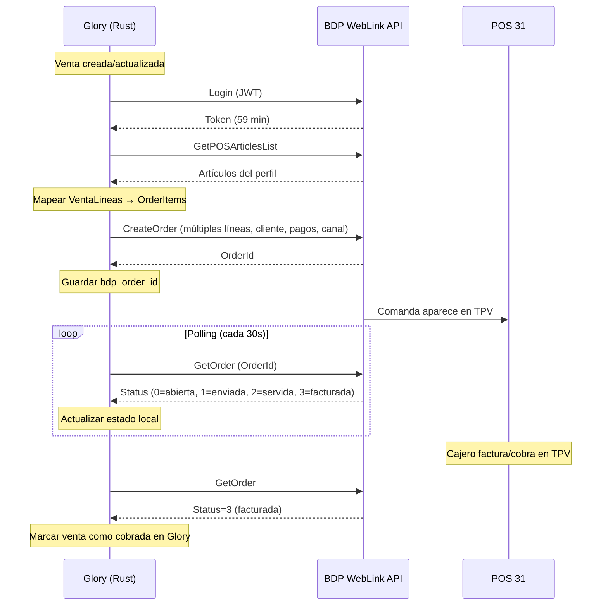

# BDP WebLink REST API — Estado de Integración

> **Fecha:** 2026-06-07 (actualizado 2026-07-15)
> **Autor:** Agente (análisis post-implementación 065A-5 + Category C tests 147A-5 + auditoría código 147A-6 + actualización secciones 3/4/5 por F2.7/F2.8/F3.1-3.3)
> **Stack:** Glory Rust Backend (Axum 0.7 + SQLx) ↔ BDP-NET WebLink REST API
> **Endpoint BDP:** `http://100.83.196.35:8068` (vía Tailscale)
> **POS:** 31 — CENTRAL 2026 (Series `00031TI`, IVA incluido)
> **Estado:** ✅ Integración verificada en producción + 6 tests Category C + 21 tests Category B + 32 tests Category A (última auditoría 2026-07-15)

---

## 1. Resumen ejecutivo

| Métrica                                                        | Valor                                       |
| -------------------------------------------------------------- | ------------------------------------------- |
| Endpoints documentados en API BDP                              | ~55                                         |
| Endpoints con constante en catálogo (`BDP_ENDPOINTS`)          | 21                                          |
| Endpoints con método en cliente (`BdpWeblinkClient`)           | 23 (incluye `check_order` variante + `post_authenticated`) |
| Endpoints invocados en sync productivo                         | **2** (`CreateOrder`, `GetPOSArticlesList`) |
| Endpoints invocados solo en preflight                          | 5 (health, get_version, export_departments_from_profile, get_employee, get_pos_employees) |
| Endpoints validados en Category C (read-only)                  | 3 (`ExportArticles`, `GetOrder`, `GetTenderList`) |
| Endpoints con cliente pero nunca llamados                      | 8 (export_customers, create_customer, cancel_order, add_order_payment, invoice_order, export_departments, get_poses, get_employees) |
| Endpoints ⚠️ con problemas conocidos                           | 2 (`GetPOS` → `[404401]`, `GetPOSes` → vacío) |
| Endpoints no implementados en absoluto                         | ~32                                         |
| Direccionalidad actual                                         | **Unidireccional (Glory → BDP)**            |
| Campos Glory no enviados en `CreateOrder`                      | ~10                                         |
| Tests BDP (Cat A + B + C)                                      | **59 tests, 59 pasando**                    |
| **Completitud de la integración**                              | **~5% del potencial**                       |

---

## 2. Inventario completo de endpoints

### Leyenda

- ✅ Catalogado + Cliente + Invocado en producción
- 📋 Catalogado + Cliente implementado, pero **nunca llamado**
- 🔧 Catalogado + Cliente, usado solo en preflight/diagnóstico
- ❌ No implementado en ninguna capa

### 2.1 Servicios

| Endpoint                | Método HTTP | Estado | Uso actual                                  |
| ----------------------- | ----------- | ------ | ------------------------------------------- |
| `ServiceHealth`         | GET         | 🔧     | Preflight: verifica conectividad            |
| `GetVersion`            | GET         | 🔧     | Preflight: versión BDP-NET                  |
| `GetApplicationVersion` | GET         | ❌     | —                                           |
| `Login`                 | POST        | ✅     | Interno: cada llamada autenticada lo invoca |

### 2.2 Artículos

| Endpoint                          | Método HTTP | Estado | Uso actual                                              |
| --------------------------------- | ----------- | ------ | ------------------------------------------------------- |
| `GetArticle`                      | POST        | ❌     | —                                                       |
| `GetPricesArticles`               | POST        | ❌     | —                                                       |
| `ExportArticles`                  | POST        | �     | Category C test: lectura catálogo contra BDP real   |
| `GetPOSArticlesList`              | POST        | ✅     | Sync: resuelve artículo por código. Preflight: verifica |
| `GetFullArticlesList`             | POST        | ❌     | —                                                       |
| `CreateArticlesAndUpdateProfiles` | POST        | ❌     | —                                                       |
| `ModifyPricesArticles`            | POST        | ❌     | —                                                       |
| `ModifyArticleAndUpdateProfile`   | POST        | ❌     | —                                                       |

### 2.3 Clientes

| Endpoint          | Método HTTP | Estado | Uso actual                          |
| ----------------- | ----------- | ------ | ----------------------------------- |
| `ExportCustomers` | POST        | 📋     | Cliente tiene método, nunca llamado |
| `CreateCustomer`  | POST        | 📋     | Cliente tiene método, nunca llamado |

### 2.4 Comandas (el núcleo de la integración)

| Endpoint          | Método HTTP | Estado | Uso actual                                                            |
| ----------------- | ----------- | ------ | --------------------------------------------------------------------- |
| `CreateOrder`     | POST        | ✅     | Sync: crea comanda (Type=0 Barra, OrderEndType=1). Preflight: dry-run |
| `GetOrder`        | POST        | �     | Category C test: lectura contra BDP real (ID inexistente) |
| `CancelOrder`     | POST        | 📋     | ⚠️ Devuelve "Subscripción no activada" — endpoint NO disponible       |
| `AddOrderTip`     | POST        | ❌     | —                                                                     |
| `AddOrderPayment` | POST        | 📋     | Cliente tiene método, nunca llamado                                   |
| `InvoiceOrder`    | POST        | 📋     | Cliente tiene método, nunca llamado                                   |

### 2.5 Comentarios

| Endpoint            | Método HTTP | Estado | Uso actual |
| ------------------- | ----------- | ------ | ---------- |
| `GetCommetsProfile` | POST        | ❌     | —          |

### 2.6 Departamentos

| Endpoint                            | Método HTTP | Estado | Uso actual                                   |
| ----------------------------------- | ----------- | ------ | -------------------------------------------- |
| `ExportDepartment`                  | POST        | 📋     | Cliente tiene método, nunca llamado          |
| `DepartmentsExportFromProfile`      | POST        | 🔧     | Preflight: verifica departamentos del perfil |
| `CreateDepartment`                  | POST        | ❌     | —                                            |
| `CreateDepartmentAndUpdateProfiles` | POST        | ❌     | —                                            |

### 2.7 Menús, Fast-Foods, Packs

| Endpoint                | Método HTTP | Estado | Uso actual |
| ----------------------- | ----------- | ------ | ---------- |
| `GetMenuDefinition`     | POST        | ❌     | —          |
| `GetFastfoodDefinition` | POST        | ❌     | —          |
| `GetPackDefinition`     | POST        | ❌     | —          |

### 2.8 Fidelización

| Endpoint    | Método HTTP | Estado | Uso actual |
| ----------- | ----------- | ------ | ---------- |
| `GetPoints` | POST        | ❌     | —          |
| `AddPoints` | POST        | ❌     | —          |

### 2.9 Terminales

| Endpoint   | Método HTTP | Estado | Uso actual                                                |
| ---------- | ----------- | ------ | --------------------------------------------------------- |
| `GetPOS`   | POST        | ⚠️    | **Devuelve `[404401]` desde ~junio 2026** — cambio en API de BDP. No afecta CreateOrder |
| `GetPOSes` | POST        | ⚠️    | **Devuelve respuesta vacía** — limitación de API. No afecta integración               |
| `GetPOSSeriesList` | POST | �     | Documentado en API (`/API/POSSeries/GetList`), probado manualmente. **Sin código**: falta path const + método cliente |

### 2.10 Empleados

| Endpoint          | Método HTTP | Estado | Uso actual                                 |
| ----------------- | ----------- | ------ | ------------------------------------------ |
| `GetEmployee`     | POST        | 🔧     | Preflight: verifica empleado configurado   |
| `GetEmployees`    | POST        | 📋     | Cliente tiene método, nunca llamado        |
| `GetPOSEmployees` | POST        | 🔧     | Preflight: verifica empleados del terminal |

### 2.11 Formas de Pago

| Endpoint           | Método HTTP | Estado | Uso actual                                      |
| ------------------ | ----------- | ------ | ----------------------------------------------- |
| `GetTenderList`    | POST        | �     | Category C test: lectura formas de pago contra BDP real |
| `GetPOSTenderList` | POST        | 🔧     | Preflight: verifica formas de pago del terminal |

### 2.12 No implementados en absoluto (~20 endpoints)

- **Perfiles:** `GetProfilesListCreateDepartmentList`, `GetProfilesListCreateArticleList`, `GetProfileListModifyArticleList`
- **Exportación:** `ExportDocumentsByExportProfile`, `ExportStockAndSalesSummaryByExportProfile`, `ExportManagmentDocumentsByExportProfile`, `ExportPurchaseNotes`
- **Stock:** `CreateFamily`, `CreateSubfamily`, `GetStock`, `GetListStock`, `GetItemCostPrices`, `GetItemsCostPrices`, `Regularizations`, `Transfers`, `UpdateMassiveStock`, `UpdateStock`, `UpdateMassiveInventory`
- **Suplementos:** `GetSupplementsProfiles`, `GetPOSSupplementsProfile`
- **Talla/Color:** `GetInfoSAC`, `GetItemSAC`
- **Salones:** `GetRoomTables`, `GetRoomsTables`
- **Series:** (ya catalogado arriba en 2.9 como 🔧)

---

## 3. Flujo actual (lo que funciona hoy)

```
Glory: Venta creada/actualizada
  → VentaService::spawn_bdp_sync()
    → BdpSyncService::sync_venta()
      → Login a BDP (admin/kamples2026, JWT ~59 min)
      → GetPOSArticlesList para resolver artículo default
      → VentaLineaRepository::listar_por_venta() → líneas (si existen)
      → resolve_line_articles(): mapea cada línea vía bdp_article_map (F2.8)
      → resolve_order_context():
          → resolve_tender_id(): metodo_pago → bdp_tender_map → TenderId (F3.2)
          → resolve_order_type(): canal → bdp_order_type_map → Type (F3.3)
          → resolve_customer(): cliente_id → Cliente → Name/Phone/Code (F3.1)
      → CreateOrder multi-item con TenderId, Type y Customer (F2.7+F3.x)
      → Guarda bdp_synced=true, bdp_order_id en BD
```

### Lo que se envía en `CreateOrder`

```json
{
    "Order": {
        "Type": 0,
        "OrderEndType": 1,
        "EmployeeId": 1,
        "ItemsProfileId": 1,
        "AlreadyInvoiced": false,
        "Invoice": false,
        "MarketplaceOrderId": "G<timestamp_15chars>",
        "ExecutionTime": "2026-07-15T12:00:00Z",
        "Comments": "Glory venta <id>",
        "TenderId": 1,
        "Customer": { "Name": "Juan García", "Phone": "600123456" },
        "Items": [
            {
                "Lin": 1,
                "Id": 549,
                "Name": "CAFE BOMBON",
                "Units": 2.0,
                "Price": 2.5,
                "Supplement": 0.0,
                "Discount": 0.0,
                "DiscountPct": false,
                "Total": 5.0,
                "VatPct": 10.0,
                "OrderItemType": 0
            },
            {
                "Lin": 2,
                "Id": 831,
                "Name": "TOSTADA",
                "Units": 1.0,
                "Price": 3.5,
                "Supplement": 0.0,
                "Discount": 0.0,
                "DiscountPct": false,
                "Total": 3.5,
                "VatPct": 10.0,
                "OrderItemType": 0
            }
        ]
    }
}
```

### Resolución de datos (F2.7–F3.3)

| Dato                 | Fuente Glory                    | Resolver                                    |
| -------------------- | ------------------------------- | ------------------------------------------- |
| Artículos por línea  | `venta_lineas[].articulo_codigo`| `bdp_article_map` → código BDP (F2.8)      |
| TenderId             | `venta.metodo_pago`             | `config.bdp_tender_map` JSONB (F3.2)       |
| Type                 | `venta.canal`                   | `config.bdp_order_type_map` JSONB (F3.3)   |
| Customer             | `venta.cliente_id`              | lookup `ClienteRepository` (F3.1)           |
| IVA% por línea       | `venta_lineas[].iva_pct`        | directo del modelo                          |
| Descuento por línea  | `venta_lineas[].descuento`      | directo del modelo                          |

### Gaps restantes del flujo

1. **Sin tracking post-creación** — No se consulta `GetOrder` para saber el estado real en BDP
2. **Sin pagos detallados** — `Payments[]` no se envía (solo `TenderId` a nivel de Order)

---

## 4. Gap de datos: Venta Glory → Order BDP

| Campo Glory                    | Tipo      | ¿Se envía? | Campo BDP                    | Notas                                           |
| ------------------------------ | --------- | ---------- | ---------------------------- | ----------------------------------------------- |
| `descripcion`                  | `String`  | ✅         | `Order.Comments`             | Via `format!("Glory venta {}", venta.id)`       |
| `canal`                        | enum      | ✅         | `Order.Type`                 | Mapeado vía `config.bdp_order_type_map` (F3.3)  |
| `metodo_pago`                  | `String`  | ✅         | `Order.TenderId`             | Mapeado vía `config.bdp_tender_map` (F3.2)      |
| `cliente_id` / datos cliente   | FK        | ✅         | `Order.Customer`             | Name + Phone + Code desde ClienteRepository (F3.1) |
| Múltiples líneas               | `Vec`     | ✅         | `Order.Items[]`              | Itera `VentaLinea[]` con artículo por línea (F2.7) |
| `iva_porcentaje` por línea     | `Decimal` | ✅         | `OrderItem.VatPct`           | `linea.iva_pct` directo del modelo              |
| Descuentos por línea           | `Decimal` | ✅         | `OrderItem.Discount`         | `linea.descuento` directo del modelo             |
| `articulo_codigo` por línea    | `String`  | ✅         | `OrderItem.Id`               | Resuelto vía `bdp_article_map` (F2.8)           |
| `comensales`                   | `i32`     | ❌         | —                            | No hay campo equivalente en BDP                 |
| `turno`                        | enum      | ❌         | —                            | No hay campo equivalente                        |
| `reserva_id`                   | FK        | ❌         | —                            | No se incluye                                   |
| Pagos detallados               | —         | ❌         | `Order.Payments[]`           | Solo se envía TenderId a nivel de Order          |

---

## 5. Datos que BDP ofrece y Aplicación no consume

| Endpoint BDP                       | Datos disponibles                                                         | Utilidad                                  |
| ---------------------------------- | ------------------------------------------------------------------------- | ----------------------------------------- |
| `ExportArticles`                   | Catálogo completo: código, descripción, 5 tarifas, dto, IVA, departamento | Sincronizar precios sin config manual     |
| `ExportCustomers`                  | Clientes: nombre, dirección, teléfono, email, NIF                         | Precargar CRM de Glory                    |
| `GetOrder`                         | Estado comanda (0=abierta, 1=enviada, 2=servida, 3=facturada...)          | Saber en Glory si ya se cobró en TPV      |
| `GetPOSTenderList`                 | Formas de pago (efectivo, tarjeta, etc.)                                  | **Ya usado en preflight**, no en sync real |
| `ExportDepartment`                 | Departamentos/categorías                                                  | Organizar productos en misma taxonomía    |
| `GetMenuDefinition`                | Definiciones de menús                                                     | Entender agrupaciones de artículos        |
| `GetFastfoodDefinition`            | Definiciones fast-food                                                    | Agrupaciones de artículos                 |
| `GetPackDefinition`                | Definiciones de packs                                                     | Agrupaciones de artículos                 |
| `GetPOSes`                         | Terminales disponibles                                                    | Verificar/configurar POS automáticamente  |
| `GetEmployees`                     | Empleados dados de alta                                                   | Validar/configurar empleado automáticamente |
| `GetPoints` / `AddPoints`          | Puntos de fidelización                                                    | Integración con programa de fidelidad     |
| `GetRoomTables` / `GetRoomsTables` | Salones y mesas                                                           | Mapear plano de sala                      |
| `GetPOSSeriesList`                 | Series de facturación                                                     | Configurar series por terminal            |

> **Nota:** Los endpoints `GetPOSArticlesList`, `GetTenderList`, `CreateOrder`, `Login` y `CheckOrder` sí se usan (ver sección 2). Los de esta tabla son los que tienen datos útiles pero ningún consumo en el flujo de sync.

---

## 6. Arquitectura actual (archivos involucrados)

| Archivo                                     | Líneas | Rol                                                               |
| ------------------------------------------- | ------ | ----------------------------------------------------------------- |
| `src/services/bdp_weblink.rs`               | 572    | Cliente HTTP base: login+token, 23 métodos, error sanitization    |
| `src/services/bdp_weblink_catalog.rs`       | 448    | 21 constantes de ruta + BDP_ENDPOINTS (21 specs), structs request/response |
| `src/services/bdp_sync.rs`                  | 1258   | `BdpSyncService`: sync_venta, retry, build_order, resolve_article, 32 unit tests |
| `src/services/bdp_sync_preflight.rs`        | 760    | `BdpSyncPreflightService`: 9 checks + dry-run CreateOrder         |
| `src/services/venta.rs`                     | 257    | `VentaService`: hooks create/update/delete para spawn BDP sync    |
| `src/handlers/ventas.rs`                    | 275    | Endpoint `POST /api/ventas/:id/bdp-sync` (retry manual)           |
| `src/models/venta.rs`                       | 183    | Modelo Venta + campos bdp_synced, bdp_order_id, etc.              |
| `src/models/configuracion.rs`               | 152    | Config: bdp_url, bdp_login, bdp_sync_enabled, bdp_tender_map, bdp_order_type_map |
| `src/repositories/venta.rs`                 | 405    | `update_bdp_status()` con `sqlx::query()` (sin macro)             |
| `tests/bdp_readonly.rs`                     | 243    | Category C: 6 tests read-only contra BDP real                     |
| `tests/bdp_article_map.rs`                 | 279    | Category B: 12 tests DB para tabla bdp_article_map                |
| `tests/bdp_venta_lineas.rs`                | 246    | Category B: 9 tests DB para venta_lineas + BDP                    |
| `migrations/20260607000000_bdp_sync_fields` | 15     | Columnas bdp en ventas (bdp_synced, bdp_order_id, bdp_error) + configuracion |
| `migrations/20260714000000_bdp_article_map` | 14     | Tabla bdp_article_map: mapeo artículos Glory ↔ BDP                |
| `migrations/20260714100000_bdp_config_fields`| 8      | Columnas bdp_tender_map y bdp_order_type_map (JSONB) en configuracion |

---

## 7. Configuración BDP actual en `configuracion`

| Campo                      | Ejemplo                     | Descripción                      |
| -------------------------- | --------------------------- | -------------------------------- |
| `bdp_sync_enabled`         | `true`                      | Activa/desactiva sync automática |
| `bdp_url`                  | `http://100.83.196.35:8068` | URL del WebLink API              |
| `bdp_login`                | `admin`                     | Usuario de autenticación         |
| `bdp_password`             | `kamples2026`               | Password (encriptado en BD)      |
| `bdp_integrator_code`      | `VBW2MBM5`                  | Código de integrador             |
| `bdp_pos_id`               | `31`                        | Terminal POS                     |
| `bdp_employee_id`          | `1`                         | Empleado por defecto             |
| `bdp_items_profile_id`     | `1`                         | Perfil de artículos              |
| `bdp_default_article_code` | `1001`                      | Artículo genérico (fallback)     |
| `bdp_default_article_name` | `CAFE BOMBON`               | Nombre del artículo genérico     |
| `bdp_tender_map`           | `{}` (JSONB)               | Mapeo `metodo_pago` Glory → código tend BDP (migración 20260714100000) |
| `bdp_order_type_map`       | `{}` (JSONB)               | Mapeo canal_venta Glory → Type BDP (migración 20260714100000)       |

### Tablas adicionales de BDP

| Tabla               | Migración              | Propósito                                                          |
| ------------------- | ---------------------- | ------------------------------------------------------------------ |
| `bdp_article_map`   | `20260714000000`       | Mapeo artículos Glory ↔ BDP (glory_article_id ↔ bdp_art_code)     |

### Campos que faltarían para integración completa

| Campo propuesto             | Tipo     | Para qué                                                                     |
| --------------------------- | -------- | ---------------------------------------------------------------------------- |
| `bdp_default_customer_code` | `String` | Cliente genérico cuando no hay `cliente_id`                                  |
| `bdp_invoice_on_create`     | `bool`   | Si debe facturar automáticamente al crear comanda                            |
| `bdp_poll_interval_secs`    | `i32`    | Intervalo de polling para `GetOrder`                                         |

---

## 8. Restricciones conocidas de la API BDP

| Restricción                                     | Detalle                                    | Impacto                                        |
| ----------------------------------------------- | ------------------------------------------ | ---------------------------------------------- |
| `MarketplaceOrderId` máx 15 chars               | Usamos `G<timestamp_14>`                   | Ninguno (resuelto)                             |
| `AlreadyInvoiced` y `Invoice` son REQUIRED      | Deben ir dentro del objeto `Order`         | Ninguno (resuelto)                             |
| `CancelOrder` NO disponible                     | Devuelve "Subscripción no activada"        | **Alto** — no se pueden cancelar comandas      |
| `Type=0` (Barra) es el único válido para POS 31 | Otros types dan error                      | **Medio** — limita mapeo de canal              |
| JWT expira en ~59 min                           | Re-login automático en cliente             | Ninguno (resuelto)                             |
| `CreateOrder` con `OnlyCheck=true`              | Solo valida, no crea                       | Útil para preflight                            |
| Solo POST y GET                                 | No hay PUT/PATCH/DELETE                    | Las actualizaciones usan endpoints específicos |
| Respuesta de `CreateOrder`                      | Devuelve `OrderId` numérico                | Se guarda como `bdp_order_id`                  |
| `POS/Get` devuelve `[404401]`                   | Desde ~junio 2026, cambio en API de BDP    | **Bajo** — solo afecta preflight/diagnóstico   |
| `POSes/Get` devuelve vacío                      | Limitación de API, no expone terminales    | **Bajo** — no se usa en flujo productivo       |
| Serie no asignable por API                      | WebLink no expode qué serie va en Mesas/Barra | **Medio** — solo configurable en TPV de escritorio |

---

## 9. Prioridades para integración completa

### Fase 1 — Comandas reales (🔴 Crítico)

| #   | Tarea                                                      | Endpoints                | Archivos afectados                                  | Esfuerzo |
| --- | ---------------------------------------------------------- | ------------------------ | --------------------------------------------------- | -------- |
| 1.1 | **Múltiples líneas** — iterar `VentaLinea` → `OrderItem[]` | `CreateOrder`            | `bdp_sync.rs`, modelo `VentaLinea`                  | Medio    |
| 1.2 | **Mapeo artículos** Glory ↔ BDP                            | `GetPOSArticlesList`     | Nuevo: `bdp_article_map` en config o tabla dedicada | Medio    |
| 1.3 | **Cliente en comanda**                                     | `CreateOrder.Customer`   | `bdp_sync.rs`, modelo `Cliente`                     | Bajo     |
| 1.4 | **Pagos en comanda**                                       | `CreateOrder.Payments[]` | `bdp_sync.rs`, config `bdp_tender_id`               | Bajo     |
| 1.5 | **Canal → Type** configurable                              | `CreateOrder.Type`       | `bdp_sync.rs`, config `bdp_order_type_map`          | Bajo     |

### Fase 2 — Lifecycle de comandas (🟡 Importante)

| #   | Tarea                                                       | Endpoints         | Archivos afectados                                      | Esfuerzo                        |
| --- | ----------------------------------------------------------- | ----------------- | ------------------------------------------------------- | ------------------------------- |
| 2.1 | **Polling de estado** — consultar `GetOrder` tras crear     | `GetOrder`        | Nuevo: `bdp_order_lifecycle.rs` o ampliar `bdp_sync.rs` | Medio                           |
| 2.2 | **Reflejar facturación** — si BDP factura, actualizar Glory | `GetOrder`        | Modelo `Venta`: nuevo campo `bdp_invoiced`              | Medio                           |
| 2.3 | **Cancelar desde Glory**                                    | `CancelOrder`     | `bdp_sync.rs`, hook en `VentaService::delete()`         | Bajo (si el endpoint se activa) |
| 2.4 | **Agregar pago desde Glory**                                | `AddOrderPayment` | Nuevo método en `bdp_sync.rs`                           | Bajo                            |
| 2.5 | **Facturar desde Glory**                                    | `InvoiceOrder`    | Nuevo método en `bdp_sync.rs`                           | Bajo                            |

### Fase 3 — Sync bidireccional (🟢 Útil)

| #   | Tarea                             | Endpoints           | Archivos afectados                 | Esfuerzo |
| --- | --------------------------------- | ------------------- | ---------------------------------- | -------- |
| 3.1 | **Exportar clientes BDP → Glory** | `ExportCustomers`   | Nuevo: `bdp_customer_sync.rs`      | Medio    |
| 3.2 | **Crear cliente Glory → BDP**     | `CreateCustomer`    | Hook en `ClienteService::create()` | Bajo     |
| 3.3 | **Exportar catálogo BDP → Glory** | `ExportArticles`    | Nuevo: `bdp_catalog_sync.rs`       | Medio    |
| 3.4 | **Sincronizar precios**           | `ExportArticles`    | Tabla de mapeo artículos           | Medio    |
| 3.5 | **Preflight como gatekeeper**     | Todos los preflight | `bdp_sync_preflight.rs`            | Bajo     |

### Fase 4 — Extensiones (⚪ Futuro)

| #   | Tarea                     | Endpoints                                | Notas                                  |
| --- | ------------------------- | ---------------------------------------- | -------------------------------------- |
| 4.1 | Fidelización (puntos)     | `GetPoints`, `AddPoints`                 | Requiere modelo de puntos en Glory     |
| 4.2 | Menús y packs             | `GetMenuDefinition`, `GetPackDefinition` | Solo lectura informativa               |
| 4.3 | Stock                     | `GetStock`, `UpdateStock`                | Requiere modelo de inventario en Glory |
| 4.4 | Salones y mesas           | `GetRoomTables`                          | Requiere integración con plano de sala |
| 4.5 | Exportación de documentos | `ExportDocumentsByExportProfile`         | Reportes/contabilidad                  |

---

## 10. Diagrama de flujo objetivo (Fase 1+2)



---

## 11. Lecciones aprendidas (de implementación 065A-5)

| Lección                                         | Detalle                                                  |
| ----------------------------------------------- | -------------------------------------------------------- |
| `AlreadyInvoiced` DEBE ir dentro de `Order`     | Si va fuera, BDP devuelve error 300005                   |
| `AlreadyInvoiced` e `Invoice` son REQUIRED      | Ambos deben estar presentes siempre                      |
| `Type=0` (Barra) es el único válido para POS 31 | Otros types devuelven error 300047                       |
| `MarketplaceOrderId` máx 15 chars               | Usar `G<timestamp_14>`                                   |
| `CancelOrder` no está disponible                | Devuelve "Subscripción no activada" — no depende de esto |
| `CreateOrder` con `OnlyCheck=true` es útil      | Permite validar sin crear (preflight dry-run)            |
| `sqlx::query()` sin macro para nuevas columnas  | Evita necesitar `cargo sqlx prepare` cada vez            |
| Mutex por `venta_id`                            | Evita race conditions en sync concurrente                |
| `#[serde(rename_all = "PascalCase")]`           | Fundamental para el contrato JSON de BDP                 |
| JWT expira en ~59 min                           | El cliente maneja re-login automáticamente               |
| `POS/Get` cambió a `[404401]` (junio 2026)      | API de BDP actualizada; no afecta CreateOrder            |
| `MarketplaceOrderId` validado estrictamente      | Máx 15 chars — error `[301011]` si excede                |
| La API no expone asignación Mesas/Barra          | Solo visible en TPV de escritorio, no por WebLink        |
| Serie `00031TI` sigue activa tras problemas      | Cliente resolvió los 4 problemas con su técnico          |

---

## 12. Archivos de referencia

| Archivo                                                    | Contenido                                                |
| ---------------------------------------------------------- | -------------------------------------------------------- |
| `WEBLINK RESTAPI.md`                                       | Documentación completa de la API BDP (raíz del proyecto) |
| `src/services/bdp_weblink_catalog.rs`                      | Constantes de ruta + BDP_ENDPOINTS + structs request/response |
| `src/services/bdp_weblink.rs`                              | Cliente HTTP con auth, 23 métodos                        |
| `src/services/bdp_sync.rs`                                 | Servicio de sync Glory → BDP + 32 unit tests             |
| `src/services/bdp_sync_preflight.rs`                       | Preflight/dry-run (9 checks)                            |
| `src/models/venta.rs`                                      | Modelo Venta con campos BDP (bdp_synced, bdp_order_id, etc.) |
| `src/models/configuracion.rs`                              | Config con campos BDP existentes (url, login, tender_map, order_type_map) |
| `src/repositories/venta.rs`                                | update_bdp_status() con sqlx::query() sin macro          |
| `tests/bdp_readonly.rs`                                    | Category C: 6 tests read-only contra BDP real            |
| `tests/bdp_article_map.rs`                                 | Category B: 12 tests DB para tabla bdp_article_map       |
| `tests/bdp_venta_lineas.rs`                                | Category B: 9 tests DB para venta_lineas + BDP           |
| `migrations/20260607000000_bdp_sync_fields.up.sql`        | Columnas BDP en ventas + configuracion                   |
| `migrations/20260714000000_bdp_article_map.up.sql`        | Tabla bdp_article_map                                    |
| `migrations/20260714100000_bdp_config_fields.up.sql`      | Columnas bdp_tender_map, bdp_order_type_map              |
| `Agente/planes/plan-bdp-sync-implementation-2026-06-07.md` | Plan de implementación original                          |
| `Agente/planes/plan-bdp-testing-2026-06-07.md`             | Plan de testing                                          |
| `Agente/planes/plan-bdp-implementacion-completa-2026-07-14.md` | Plan maestro: 6 fases, análisis cobertura, tests  |

---

## 13. Tests Category C — Resultados contra BDP real

> **Fecha ejecución:** 2026-07-14
> **Comando:** `cargo test --test bdp_readonly -- --include-ignored`
> **BDP endpoint:** `http://100.83.196.35:8068` (Tailscale, online)
> **Resultado global:** ✅ **6/6 pasaron, 0 fallaron**

### Tests ejecutados

| # | Test                                   | Qué hace                                       | Resultado | Tiempo |
| --- | -------------------------------------- | ---------------------------------------------- | --------- | ------ |
| 1 | `bdp_real_health`                      | GET `/ServiceHealth` (sin auth)                | ✅ PASS   | ~0ms   |
| 2 | `bdp_real_login`                       | POST `/Login` con credenciales de `.env`       | ✅ PASS   | ~0ms   |
| 3 | `bdp_real_export_articles`             | Login + POST `ExportArticles` (lectura catálogo) | ✅ PASS | ~0ms   |
| 4 | `bdp_real_get_tenders`                 | Login + POST `GetTenderList` (formas de pago)  | ✅ PASS   | ~0ms   |
| 5 | `bdp_real_get_order_inexistente`       | Login + POST `GetOrder` con ID inexistente     | ✅ PASS   | ~0ms   |
| 6 | `bdp_real_login_then_export_articles`  | Login + ExportArticles (flujo combinado)       | ✅ PASS   | ~0ms   |

### Cobertura Category C

| Dimensión                           | Cubierta | Test(s)                                      |
| ----------------------------------- | -------- | -------------------------------------------- |
| Conectividad HTTP → BDP             | ✅       | `bdp_real_health`                            |
| Autenticación (Login + JWT)         | ✅       | `bdp_real_login`, `bdp_real_login_then_export_articles` |
| Lectura catálogo artículos          | ✅       | `bdp_real_export_articles`, `bdp_real_login_then_export_articles` |
| Lectura formas de pago              | ✅       | `bdp_real_get_tenders`                       |
| Lectura comanda (caso inexistente)  | ✅       | `bdp_real_get_order_inexistente`             |
| Creación de comanda                 | ❌       | Excluido (requiere OnlyCheck=true para ser read-only) |
| Cancelación de comanda              | ❌       | Excluido (endpoint no disponible según restricciones) |

### Seguridad — validación previa

Los 6 tests son **estrictamente read-only**:
- `health`: no requiere auth, solo lectura de estado del servicio
- `login`: crea un session token pero no modifica datos
- `export_articles`: lectura del catálogo de artículos
- `get_tenders`: lectura de formas de pago del terminal
- `get_order_inexistente`: consulta de una orden que no existe (no crea nada)
- `login_then_export_articles`: combinación de login + lectura

Ningún test ejecuta `CreateOrder`, `CancelOrder`, `AddOrderPayment`, `InvoiceOrder` ni ningún endpoint de escritura.
